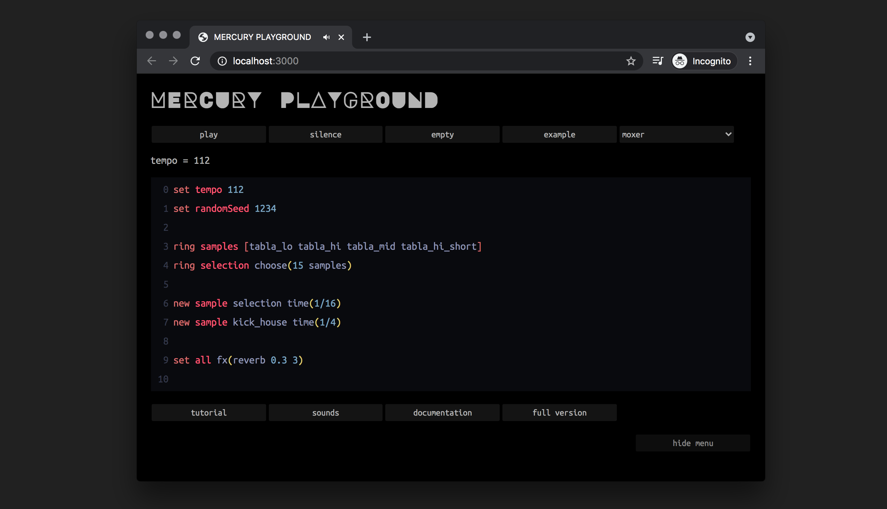

# 🌕 Mercury Live Coding Playground


**Welcome to the Mercury Playground! ✌️ ☮️ Make Music, Not War!** ☮️ ✌️

**Mercury Playground is a free/open-source, beginner-friendly, minimal and human-readable language for the live coding of algorithmic electronic music performances running in the browser**

Mercury currently has 2 versions:

* Web version running in the browser (Windows/Mac/Linux) (you're in the right place)
* Original version running in Max8 (Windows/Mac only) [go to this repo](https://github.com/tmhglnd/mercury)

[**🚀 Start coding directly in the playground!** (recommended for beginners)](https://mercury.timohoogland.com/)

**👾 Or code with the latest full version in Max8:**

`git clone https://github.com/tmhglnd/mercury.git`

[**📟 Build a local app from the browser version with Electron**](https://github.com/tmhglnd/mercury-app)

[**🙏 Support Mercury by buying me a coffee ko-fi**](https://ko-fi.com/tmhglnd)

[**💬 Join the Mercury Community on Discord**](https://discord.gg/vt59NYU)



## 📋 Table of Contents

<!-- - [Newest Features](#-newest-features) -->
- 📟 [Mercury?](#-about)
- 🎮 [What can I do with Mercury?](#-features-overview)
- 👩‍💻 [Code together with others!](#-collaborative-coding)
- 🚀 [Let's get started!](#-install)
	- [Tutorial](https://tmhglnd.github.io/mercury/docs/usage/coding)
	- [Documentation](https://tmhglnd.github.io/mercury/docs/)
	- [System Requirements](#-system-requirements)
	- [Sounds in Mercury](#-sounds)
- 🤓 [I like to help](#-contribute)
- 🔋 [Powered By](#-powered-by)
- 🙏 [Thanks](#-thanks)
- 📄 [Licenses](#-licenses)

## 📟 About 

**Mercury is a free/open-source, beginner-friendly, minimal and human-readable language for the live coding of algorithmic electronic music** 

All elements of the language are designed around making code more accessible and less obfuscating for the audience. This motivation stretches down to the coding style itself which uses clear descriptive names for functions and a clear syntax. Furthermore the editor is restricted to 30 lines of code, keeping all code always visible. Mercury provides the performer with an extensive library of algorithms to generate or transform numbersequences that can modulate parameters, such as melody and rhythm, over time. The environment produces sound in conjunction with visuals. Besides looking at the code, the audience is also looking at the visuals that are reactive to the sound or generated by the sound.

It is named after te planet Mercury. Mercury rules the creation and expression of our mental processes. The planet implores us to express ourselves. Mercury is about a quick wit, quick thinking. It lets us move from one thing to the next.

## 🎮 Features Overview

Quick access to playback of samples and change timing and tempo of samples or synthesizers

```java
set tempo 89

new sample kick_909 time(1/4)
new sample hat_909 time(3/16)
```

Make rhythmic patterns with sequences of numbers and probabilities

```java
list loBeat [1 0 0 1 0.5]
list hiBeat [0 1 0.2 0]

new sample tabla_lo time(1/8) play(loBeat)
new sample tabla_hi time(1/8) play(hiBeat)
```

Generate psuedorandom melodic content for a synthesizer in a range and set a scale

```java
set scale minor a
set randomSeed 31415

list melody random(16 0 24)

new synth saw note(melody) time(1/16) shape(4 100)
```

Generate sequences algorithmically to compose complex structures and choose from an extensive library of algorithms to work with

```java
set tempo 132
list rhythm euclid(32 13)

list melody spread(5 0 24)
list melody palindrome(melody)
list melody clone(melody 0 5 7 3)
list melody lace(melody melody)

new synth triangle time(1/16) note(melody 1) shape(1 80) play(rhythm)
```

Design sounds with various effects (and upload your own sounds to use)

```java
new sample chimes time(2) speed(0.25) fx(reverb 0.3 15) fx(drive 10) fx(shift 3 0.5)
```

Easily give multiple instruments the same effects

```java
new sample chimes time(2)
new sample harp_down time(3)
new sample gong_lo time(5)

set all fx(reverb 0.5 11) fx(drive 1.5) fx(filter low 2000 0.6)
```

Sync audio loops to the tempo of your music

```java
set tempo 97

new loop amen time(1)
new sample kick_house time(1/4)
```

Control external midi devices or applications by sending midi and cc <!--and use clock sync-->

```java
new midi "Your Awesome Midi Device" time(1/16) note(7 1) name(mDev)
    set mDev length(1/16) gain(0.8) chord(off)
    set mDev cc(10 [20 50 100])
```

Sequence Hyrda visuals with instruments (experimental)

```java
list hydras ['osc(10,0.1,2).out()' 'osc(20,-0.5,5).out()' 'osc(5,1,12).out()']

new sample kick_min time(1/16) play([1 0 0 1 0]) visual(hydras)
```
<!-- 
Control other environments via OSC-messages

```java
ring params [0.25 0.5 0.75]

new emitter osc address(yourDevice) theParam(params) time(1/4)

// emits => /yourDevice/theParam 0.25
//          /yourDevice/theParam 0.5
//          /yourDevice/theParam 0.75
//          /yourDevice/theParam 0.25
//          etc...
```
-->

Easily control parameters in Mercury via external OSC-messages (only when running [localhost](#-install))

```java
new synth triangle fx(reverb '/synth/verb') fx(filter low '/synth/cutoff' 0.4) time(1) shape(1 'synth/length')
```

**AND MANY MORE (TO COME...)**

The playground (browser version) does not have exactly the same functionality as the original Mercury environment running in Max8. See below the differences. You may also encounter some discrepancies in syntax and in the documentation. Please report issues if you find any so they can be fixed. Items marked with a `*` are only available in the browser version.

- [x] tempo
- [x] scale
- [ ] scalar
- [x] volume
- [x] lowpass / highpass
- [x] randomSeed
- [x] print
- [x] view (*)
- [x] crossFade (*)
- [x] list
	- [x] spread / spreadInc / fill / spreadF / spreadIncF
 	- [x] binaryBeat / spacingBeat
	- [x] random / coin / dice / choose / pick / drunk / urn / shuffle / clave
	- [x] sine / cosine / sineF / cosineF
	- [x] join / duplicate / merge / repeat / lace
	- [x] merge / reverse / invert / palindrome
	- [x] expand / stretch / clone / spray / unique
	- [x] fibonacci / pisano / pell / lucas
	- [x] euclidean / hexBeat
	- [x] add / subtract / multiply / divide / modulo
- [x] sample
	- [x] type
	- [x] time
 	- [x] timediv (*)
  	- [ ] ratchet
  	- [ ] warp
	- [x] shape
	- [x] play
	- [x] gain
	- [x] speed
		- [ ] reverse
	- [x] note
		- [x] tune (*)
	- [x] pan
	- [x] name
 	- [ ] group
	- [x] fx
- [x] synth
	- [x] super / unison
	- [x] time
	- [x] shape
	- [x] play
	- [x] timediv (*)
  	- [ ] ratchet
  	- [ ] warp
	- [x] gain
	- [x] note
		- [x] map to scale
	- [x] pan
	- [x] name
 	- [ ] group
	- [x] fx
	- [x] slide
- [ ] sampler
- [x] polySynth
	- [x] steal
 	- [ ] voices 
- [x] polySample
	- [x] steal
 	- [ ] voices
- [ ] midi
	- [x] device
	- [x] time
	- [x] length
	- [x] gain
	- [x] out
	- [x] chord
	- [x] name
	- [x] change / cc
 	- [x] program / pc
	- [ ] bend
	- [ ] sync
- [ ] osc
	- [x] receive parameters as arguments
	- [ ] send osc messages as an intrument
- [ ] fx
	- [x] degrade (chip)
	- [x] delay
		- [x] stereo feedback delay with damping
		- [ ] ping pong feedback delay
	- [x] distort (softclipping distortion)
	- [x] squash (compression/overdrive)
	- [ ] kink (waveshaping)
	- [x] filter
 		- [x] filter modulation
	- [x] triggerFilter
	- [x] lfo
	- [x] reverb
		- [x] decaying noise convolution
		- [ ] dattorro reverb algorithm
	- [x] shift (pitchshift)
 	- [x] compress 
	- [x] chorus / double
- [x] visual 
	- [x] use Hydra code synchronized with instrument triggers (*)

⭐️ *watch and star this repo to keep up-to-date with the latest changes whenever they're made*

## 👩‍💻👨‍💻 Collaborative Coding

You can code together in Mercury by using the amazing [**Flok**](https://flok.cc/) live coding environment for the browser developed by Damián Silvani (a.k.a. Munshkr). Flok is a web-based P2P collaborative editor for live coding music and graphics. Similar to Etherpad, but focused on code evaluation for livecoding.

- [Start coding together here](https://tmhglnd.github.io/mercury/docs/collaborate#flok--mercuryplayground)

## 🚀 Install

😎 **No need for installing!** You can start coding immediately in the browser:

[**https://mercury.timohoogland.com/**](https://mercury.timohoogland.com/)

### 💻 Running without internet

🤓 If you want to run the MercuryPlayground locally (for using without internet, or using the OSC-messages functionality, or when developing extra features) you can follow these steps:

- [Running the Mercury Playground without internet](https://tmhglnd.github.io/mercury/docs/getting-started#-without-internet)

## 📖 Documentation

Full explanation of all the possibilities in Mercury:

- [Open the documentation](https://tmhglnd.github.io/mercury/docs)

**NB: There are still some differences between the Mercury Playground and the Max8 version. If you find any discrepancies please report an issue**

## 💻 System Requirements

Any laptop/desktop that runs a chromium based browser like Chrome or Brave.

## 🎵 Sounds

Most of the sounds in Mercury are from [freesound.org](http://www.freesound.org) and are licensed with Creative Commons Attribution or Creative Commons 0 licenses. If not downloaded from freesound it is made sure that the license allows you to redistribute the sounds via the Mercury environment and that you can use them in your projects. All the sounds are listed below with their original source, license and credits.

- [List of sounds and credits](https://tmhglnd.github.io/mercury/docs/usage/sounds)

### Use your own sounds

- [Add your own sounds in the browser version](https://tmhglnd.github.io/mercury/docs/usage/playground-overview#add-sounds)

## ⚡️ Visuals

You can load Hydra visuals by pasting the code in the textarea below the Editor. Removing the code will disable the visual rendering. [Hydra](https://hydra.ojack.xyz/) is a Live coding visual synthesizer developed Olivia Jack.


[*Visual "Pixelscape" by Marianne Teixido*](https://hydra.ojack.xyz/?code=JTJGJTJGUGl4ZWxzY2FwZSUwQSUyRiUyRk1hcmlhbm5lJTIwVGVpeGlkbyUwQSUyRiUyRmh0dHBzJTNBJTJGJTJGZ2l0aHViLmNvbSUyRk1hcmlhbm5lVGVpeGlkbyUwQSUwQXNyYyhvMCklMEElMjAuc2F0dXJhdGUoMS4wMSklMEElMjAuc2NhbGUoLjk5OSklMEElMjAuY29sb3IoMS4wMSUyQzEuMDElMkMxLjAxKSUwQSUyMC5odWUoLjAxKSUwQSUyMC5tb2R1bGF0ZUh1ZShzcmMobzEpLmh1ZSguMykucG9zdGVyaXplKC0xKS5jb250cmFzdCguNyklMkMyKSUwQSUyMCUyMC5sYXllcihzcmMobzEpJTBBJTIwJTIwJTIwJTIwJTIwJTIwJTIwJTIwJTIwLmx1bWEoKSUwQSUyMCUyMCUyMCUyMCUyMCUyMCUyMCUyMCUyMC5tdWx0KGdyYWRpZW50KDEpJTBBJTIwJTIwJTIwJTIwJTIwJTIwJTIwJTIwJTIwJTIwJTIwJTIwJTIwJTIwJTIwLnNhdHVyYXRlKC45KSkpJTBBJTIwJTIwLm91dChvMCklMEElMEFub2lzZSgxJTJDJTIwLjIpJTBBJTIwJTIwLnJvdGF0ZSgyJTJDLjUpJTBBJTIwJTIwLmxheWVyKHNyYyhvMCklMEElMjAlMjAuc2Nyb2xsWCguMikpJTBBJTIwJTIwLm91dChvMSklMEElMEFyZW5kZXIobzAp)

You can also code a small Hydra snippet inside the `visual()` function. This function can be added to a specific instrument and is evaluated upon triggering of the instrument. Please see tutorial `601` on the mercury playground site.

## 👾 Made with Mercury

*Made something with Mercury? Please add a URL here and send a pull request!* 😎

[**See the full list here**](https://tmhglnd.github.io/mercury/docs/about/inspiration)

### Small selection

- [iTypeMusic - Electronic Music Stream with Live Coding](https://www.youtube.com/watch?v=x77RP20uWxA&ab_channel=itypemusic)
- [LXT @levoxtrip (at Solstice Stream December 2023)](https://www.youtube.com/watch?v=TzM-koWkRow&ab_channel=Eulerroom)
- [Linalab(Mercury) + Turbulente(p5Live) - Live at Algorave Lisbon](https://youtu.be/WSPNDC0a2X4)
- [T.mo - Liber Abaci (Mercury Coding Sessions)](https://youtu.be/syUL76qCV6w)
- [Roald van Dillewijn - Smashing Temparateness (Mercury Coding Sessions)](https://youtu.be/KJ4OpJ3-Ik0)
- [Guillem Góngora Moral - Transcription #1 (Mercury Coding Sessions)](https://youtu.be/wRVQHlghitM)
- [Anne Veinberg - CodeKlavier meets Mercury (Mercury Coding Sessions)](https://youtu.be/e4sPKOlaYS8)
- [Nick Levantis - Wake Up](https://youtu.be/UsfKF0ggn7k)

## 📝 Contribute

Contributions to the Mercury environment are much appreciated in whatever form they come! You can contribute in any many ways!

[Please follow the steps here](https://tmhglnd.github.io/mercury/docs/contribute)

## 🔋 Powered By

- Mercury was granted funding from [**Creative Industries Fund NL**](https://stimuleringsfonds.nl/en/)
- Mercury was granted in-kind funding from [**Creative Coding Utrecht**](https://creativecodingutrecht.nl/)

## 🙏 Thanks

- [Lina Bautista](https://axolot.cat/about/lina-bautista/) for working together on developing functionalities in Mercury to control modular synths via cv
- [SEMA/MIMIC project](https://mimicproject.com/about) team (Thor Magnusson, Chris Kiefer and Francisco Bernardo) for their awesome full week workshop at Sussex University in Brighton on designing a live coding language in the browser combined with machine learning
- [Roald van Dillewijn](https://roaldvandillewijn.nl/) for working together on osc and midi functionalities combined with his [Digilog modified guitar-pedals](https://roaldvandillewijn.nl/projects/digilog)
- [Guillem Gongora Moral](https://www.guillemgongora.com/) for using Mercury as a composition tool and sharing valuable feedback in the process
- [Anne Veinberg](https://anneveinberg.com/) for working with Mercury and a Mercury extensions for the [CodeKlavier](https://codeklavier.space/) project
- [Rafaele Maria Andrade](https://www.rafaele-andrade.com/) for collaboration on [networked performance](https://www.youtube.com/watch?v=7UWywv_DPHI&t=4s) between Mercury and Knurl
- Live performance image by Zuzanna Zgierska

## ✨ Inspiration

During the development of Mercury (both the playground and the full version) I've found inspiration in many other live coding environments, practices and platforms. Some of these are:

- [Hydra](https://hydra.ojack.xyz/) - Live coding visual synthesizer by Olivia Jack
- [Sema](https://sema.codes/about) - Live coding language design platform combined with Machine Learning
- [MIMIC Project](https://mimicproject.com/about) - a web platform for the artistic exploration of musical machine learning and machine listening.
- [Tidal](https://tidalcycles.org/index.php/Welcome) - Live coding of patterns
- [Sonic Pi](https://sonic-pi.net/) - The live coding synth for everyone
- [Tone.js](https://tonejs.github.io/) - Webaudio framework for programming synths and sequencers
- [Nearley](https://nearley.js.org/) - Parsing toolkit

## 📄 Licenses

- Main Source - [The GNU GPL v.3 License](https://choosealicense.com/licenses/gpl-3.0/) (c) Timo Hoogland 2019-2024
- Sound Files - Individually licensed, listed under [Sounds in Mercury](https://tmhglnd.github.io/mercury/docs/usage/sounds#sample-credits)
- Documentation - [The CC BY-SA 4.0 License](https://creativecommons.org/licenses/by-sa/4.0/) (c) Timo Hoogland 2019-2024
- Examples - [The CC BY-SA 4.0 License](https://creativecommons.org/licenses/by-sa/4.0/) (c) Timo Hoogland 2019-2024

THE SOFTWARE IS PROVIDED "AS IS", WITHOUT WARRANTY OF ANY KIND, EXPRESS OR IMPLIED, INCLUDING BUT NOT LIMITED TO THE WARRANTIES OF MERCHANTABILITY, FITNESS FOR A PARTICULAR PURPOSE AND NONINFRINGEMENT. IN NO EVENT SHALL THE AUTHORS OR COPYRIGHT HOLDERS BE LIABLE FOR ANY CLAIM, DAMAGES OR OTHER LIABILITY, WHETHER IN AN ACTION OF CONTRACT, TORT OR OTHERWISE, ARISING FROM, OUT OF OR IN CONNECTION WITH THE SOFTWARE OR THE USE OR OTHER DEALINGS IN THE SOFTWARE.
